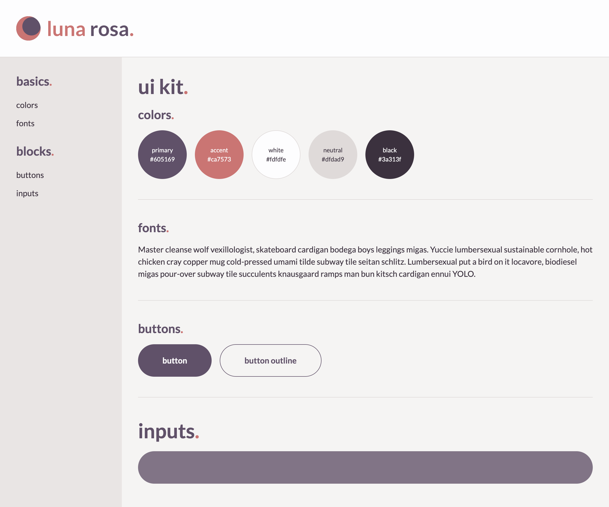

# luna rosa.

luna rosa starter ui kit.


## initial install.

```bash
npm install
```

note: this project was created with node 18.16.0 / npm 9.5.1.


## start development server.

```bash
npm start
```

this will open `localhost:20234/ui/index.html`
