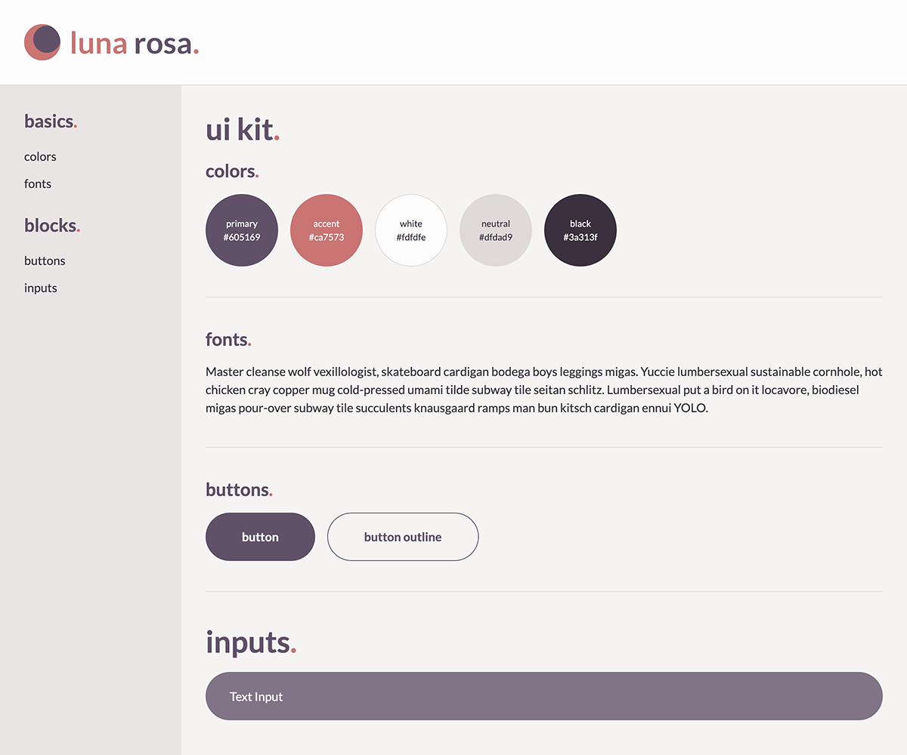

# luna rosa.

luna rosa starter ui kit.


## initial install.

```bash
npm install
```

note: this project was created with node 18.16.0 / npm 9.5.1.


## start development server.

```bash
npm start
```

this will open `localhost:20234/ui/index.html`


## additional resources.

### background image.
- **unsplash:** [unsplash.com/photos/jCL98LGaeoE](https://unsplash.com/photos/jCL98LGaeoE)

### icons.
- **phosphor icons:** [phosphoricons.com](https://phosphoricons.com)

### ui designs + ui kit.
- **dribbble:** [dribbble.com/shots/20990608-luna-rosa-sign-in-sign-up-ui-kit](https://dribbble.com/shots/20990608-luna-rosa-sign-in-sign-up-ui-kit)
- **figma:** [figma.com/file/5cIal4BZwhG7p3AN7I9qpJ/luna-rosa?node-id=1%3A3&t=xX78DjbhvlEI0r2j-1](https://www.figma.com/file/5cIal4BZwhG7p3AN7I9qpJ/luna-rosa?node-id=1%3A3&t=xX78DjbhvlEI0r2j-1)

### code for sign in + sign up pages on codepen (html + css + tailwind).

- **sign in page:** [codepen.io/mranenko/full/VwEMKBE](https://codepen.io/mranenko/full/VwEMKBE)
- **sign up page:** [codepen.io/mranenko/full/VwEMPQp](https://codepen.io/mranenko/full/VwEMPQp)
